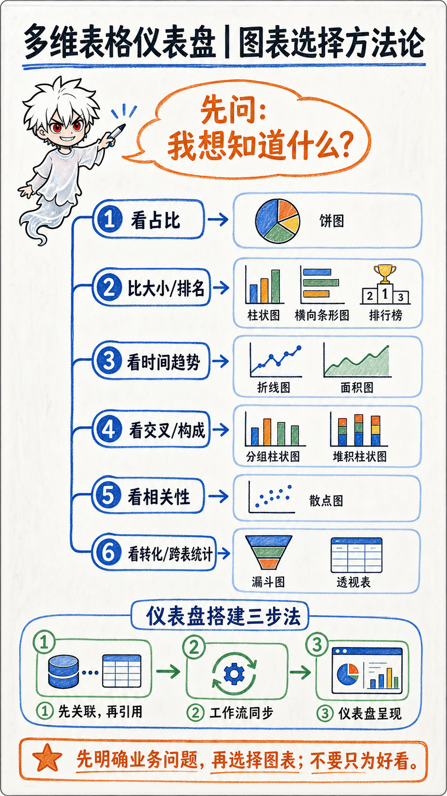
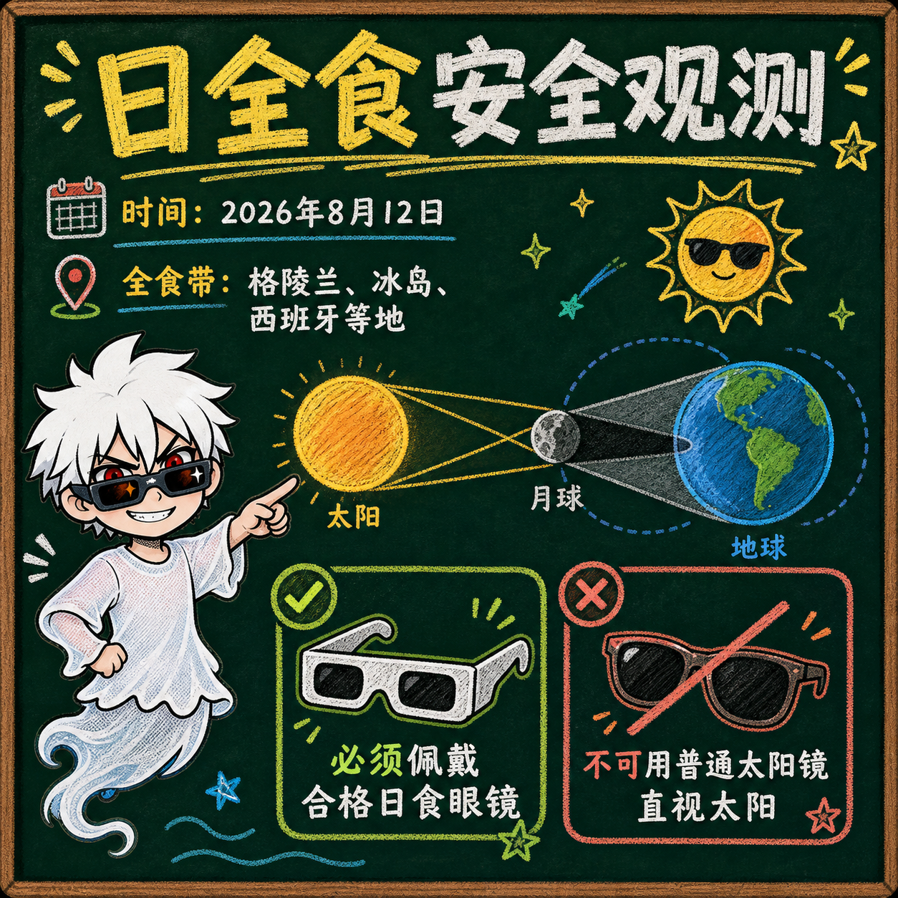
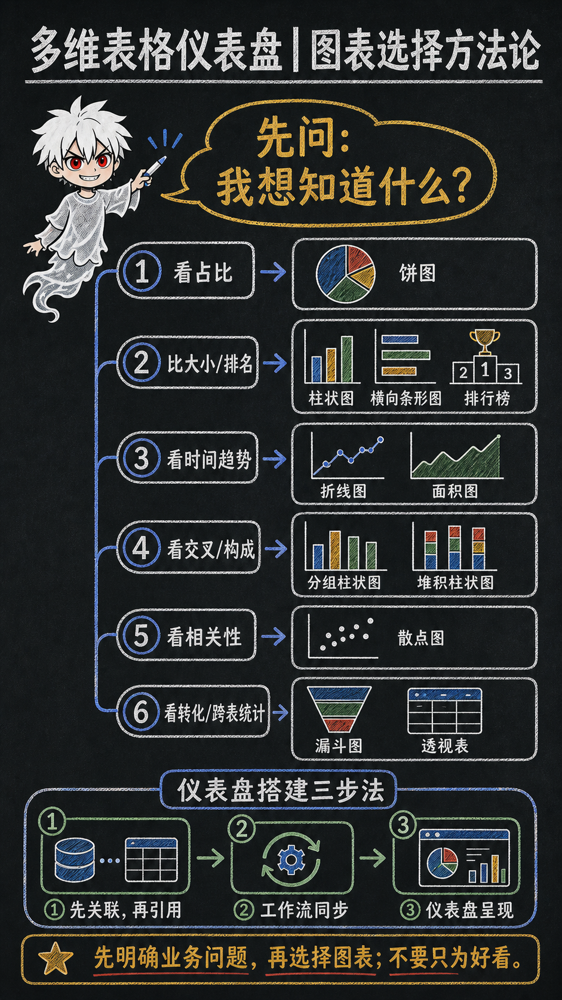
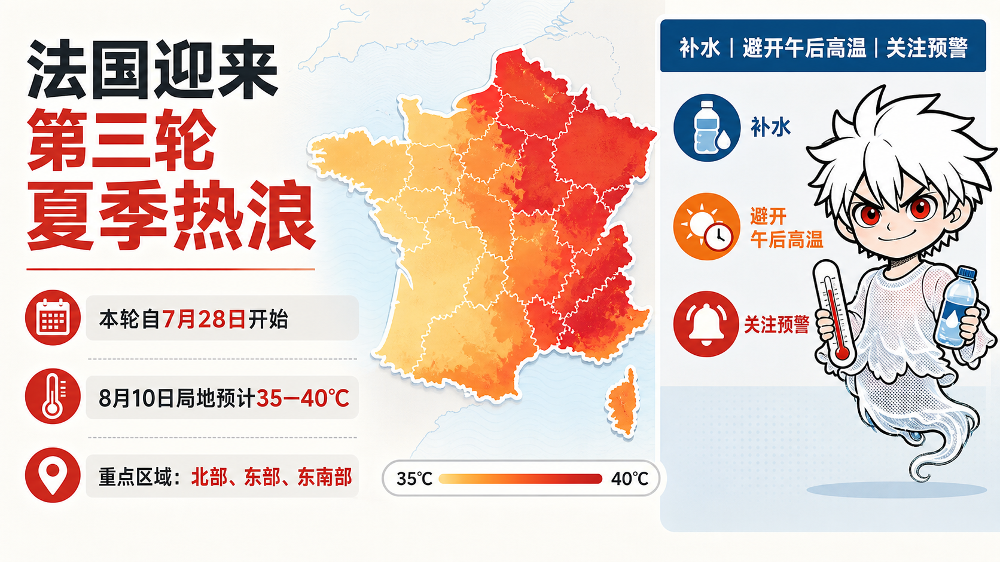
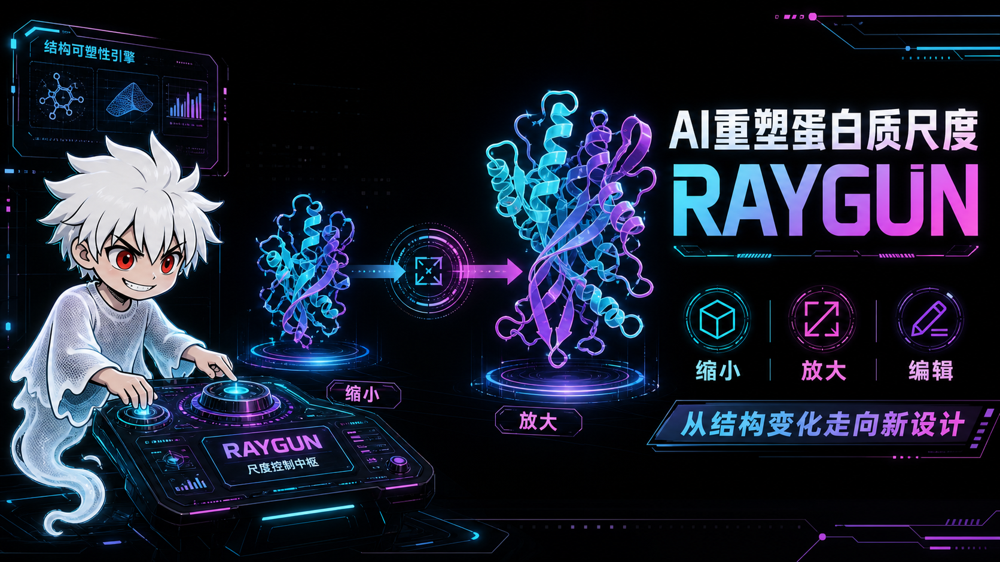
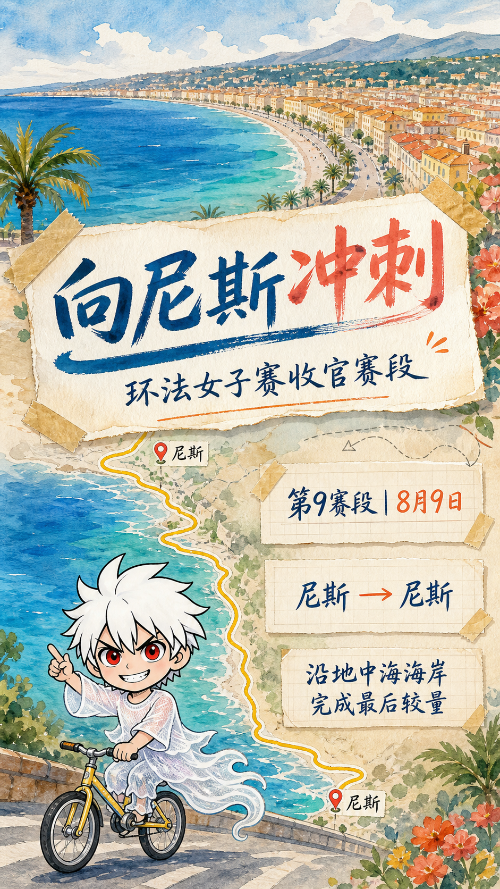
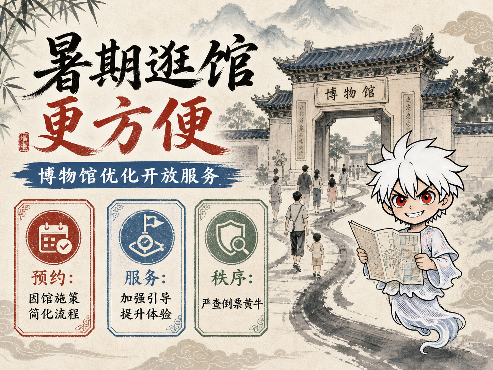
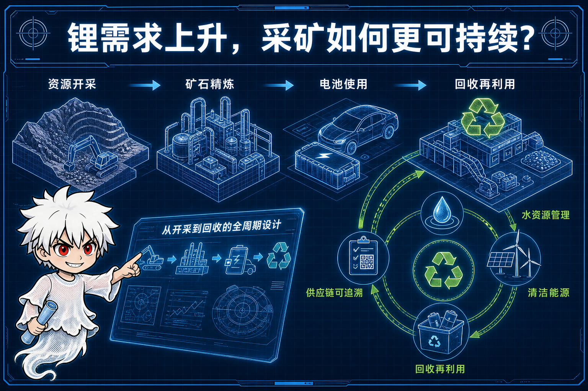
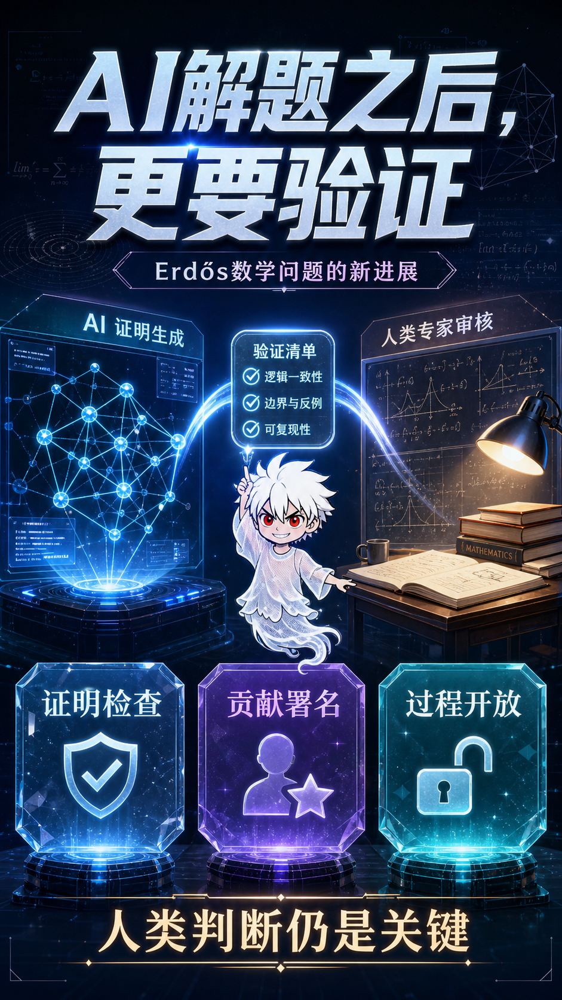
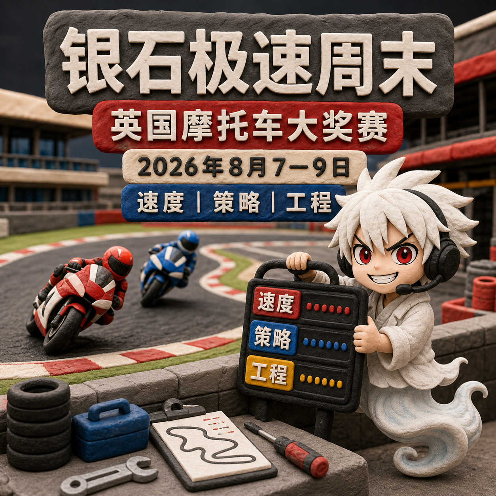

# Loki Image2

`loki-image2` 是一个面向 Codex 的品牌信息图 Skill，可把文本、文档、音频或图片整理成信息图方案、可复用 Prompt，或在明确确认后生成图片。

## 12 套视觉风格预览

<table>
  <tr>
    <td></td>
    <td></td>
  </tr>
  <tr>
    <td></td>
    <td></td>
  </tr>
  <tr>
    <td></td>
    <td></td>
  </tr>
  <tr>
    <td></td>
    <td></td>
  </tr>
  <tr>
    <td></td>
    <td></td>
  </tr>
  <tr>
    <td></td>
    <td></td>
  </tr>
</table>

## 主要能力

- `plan`：只输出内容分析、层级、布局与风格建议。
- `prompt`：输出方案和最终 Prompt，不调用生图服务。
- `generate`：完成确认后，通过 Codex 内置 imagegen、APIMart 或 OpenAI Images-compatible 端点生成图片。
- 默认使用 Loki IP，也支持关闭 IP、临时上传角色，以及保存可复用的自定义品牌。
- 内置 12 套视觉风格，未指定时根据内容自动推荐。
- 支持文本、常见文档、音频和图片；首版不支持视频。

## 安装

将仓库中的 `loki-image2` 目录复制到 Codex skills 目录：

```text
$CODEX_HOME/skills/loki-image2
```

重新开始一轮 Codex 对话后调用：

```text
$loki-image2 阅读这篇文章，帮我规划一张信息图
```

```text
$loki-image2 使用 prompt 模式输出可复用的生图提示词
```

```text
$loki-image2 使用 generate 模式直接生成图片
```

## 生成确认

每个新任务首次生成前必须明确确认以下七项：

1. 品牌/IP 状态
2. 风格
3. Provider
4. 比例
5. 质量或质量意图
6. 图片数量
7. 文字语言

每一次实际生成（包括迭代）都必须重新确认当前比例。Provider、质量或数量变化后恢复完整确认。失败后不会自动重新生成或切换 Provider。

## Provider

### Codex 内置 imagegen

由 Codex 直接调用内置生图能力，不需要第三方 API Key。该渠道没有独立的 `quality` 参数，Skill 会在 Prompt 中表达高质量意图。

### APIMart

- 模型：`gpt-image-2`
- 环境变量：`APIMART_API_KEY`
- 质量映射：`draft → 1k`、`standard → 2k`、`high → 4k`

本地 Loki 参考图必须通过 `--reference-image-file` 显式传入；选择 `--brand loki` 不会自动上传图片。

### OpenAI Images-compatible

- 默认环境变量：`CUSTOM_IMAGE_API_KEY`
- 需要明确提供 `base_url` 与 `model`
- 未声明端点质量能力时省略 `quality`
- 只有提供 `--custom-quality-map` 时才发送对应质量值

API Key 只从环境变量读取，不接受命令行明文 Key。

## 安全设计

- 生成 POST 只提交一次；模糊超时不会自动重投，避免重复计费。
- APIMart 只对安全的任务状态 GET 进行有限退避重试。
- 不自动切换 Provider。
- 日志、错误和元数据不记录 API Key、Authorization、完整 Prompt 或原始输入。
- 图片下载逐跳验证重定向地址，并限制响应大小、文件类型和跳转次数。
- 本地参考图片使用安全文件句柄读取，并验证 PNG/JPEG/WebP 文件签名。
- 输出目录排他创建，避免覆盖同秒同主题任务。

更多 Provider 和 CLI 说明见 [`loki-image2/references/providers.md`](loki-image2/references/providers.md)。

## 测试

```powershell
$env:PYTHONDONTWRITEBYTECODE='1'
python -m unittest discover -s .\loki-image2\tests -t .\loki-image2 -v
```

当前离线测试共 133 项，覆盖品牌包、路径安全、日志脱敏、Provider 契约、CLI 门禁、下载限制和 Skill 文档合同。真实 Provider 行为仍取决于对应服务的当前 API 兼容性。

## 目录

```text
loki-image2/
├── SKILL.md
├── agents/openai.yaml
├── assets/brands/loki/
├── references/
├── scripts/
│   └── providers/
└── tests/
    └── fixtures/
```
